<div align="center">

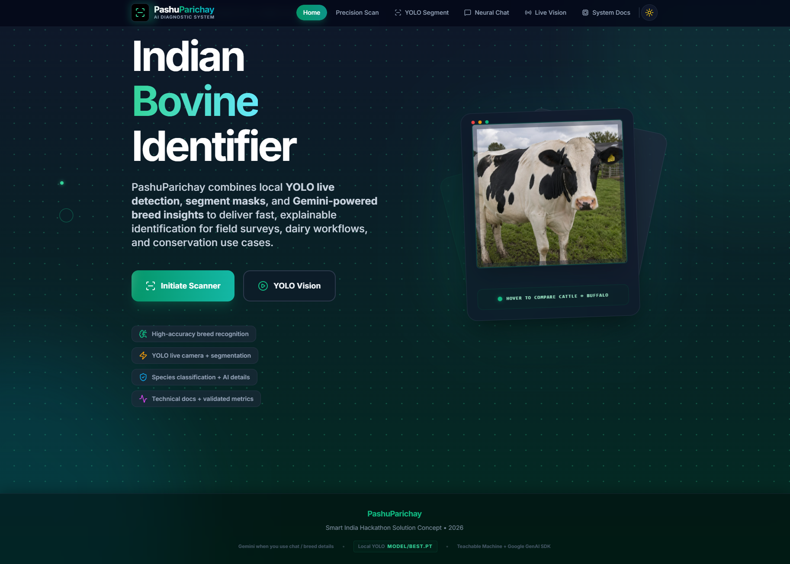

# PashuParichay

**AI-assisted indigenous cattle & buffalo breed recognition** — YOLO segmentation, Teachable Machine fast mode, and Gemini for explanations and chat.

*Smart India Hackathon–style solution concept · 2026*


</div>

---

## What this project does

PashuParichay is a hybrid **edge + cloud livestock intelligence system** designed for Indian cattle and buffalo breed workflows. It combines:

- **Offline-first visual recognition** with Teachable Machine (Fast Mode) for instant local predictions.
- **Deep multimodal analysis** with Gemini (Precision Mode) for richer breed reasoning and structured details.
- **Local YOLO API inference** for boxes/masks and live camera detection via a Python FastAPI backend.
- **Decision support actions** such as market/news lookup and nearby vet discovery.

In practice, the app supports these end-user flows:

1. Upload/scan image or video.
2. Get a rapid local breed guess (Fast Mode).
3. Get a deeper AI explanation (Precision Mode).
4. Inspect enriched breed profile (traits, origin, utility, confidence).
5. Use operational helpers (market info, vet discovery, live assistant/chat).

---

## Problem it solves

Manual breed identification in field conditions is error-prone and slow, especially with mixed-quality images, crossbreeds, and variable lighting.  
This project provides a practical interface for:

- Breed-level screening in dairy and livestock workflows.
- Faster first-pass triage in the field (offline-capable path).
- Explainable follow-up analysis for users who need more confidence.
- Technical documentation + validation artifacts for research/demo contexts.

---

## What’s in the box

| Capability | How it works |
|------------|----------------|
| **YOLO Segment** | Local FastAPI + Ultralytics `best.pt` — boxes, masks, live camera with auto-pause on confident detections |
| **Precision Scan** | Gemini vision for deep analysis when `GEMINI_API_KEY` is set |
| **Fast Scan** | TensorFlow.js Teachable Machine models in the browser |
| **Neural Chat** | Gemini text chat |
| **Live Vision** | Gemini Live (audio/video) — separate from offline YOLO |

In-app **Technical documentation** (navbar) includes architecture, metrics charts, and the **`#yolo`** section for training and dataset notes.

---

## Screenshots & figures

Replace placeholders with your own exports and UI captures as you polish the demo.

**Validation plots** (used on the Technical Docs page — currently placeholder PNGs; swap for real Ultralytics curves):

| P–R curve | Normalized confusion |
|-----------|----------------------|
| 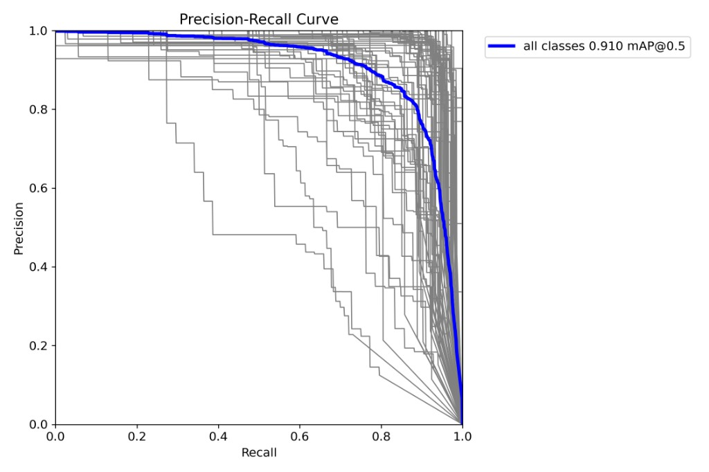 | 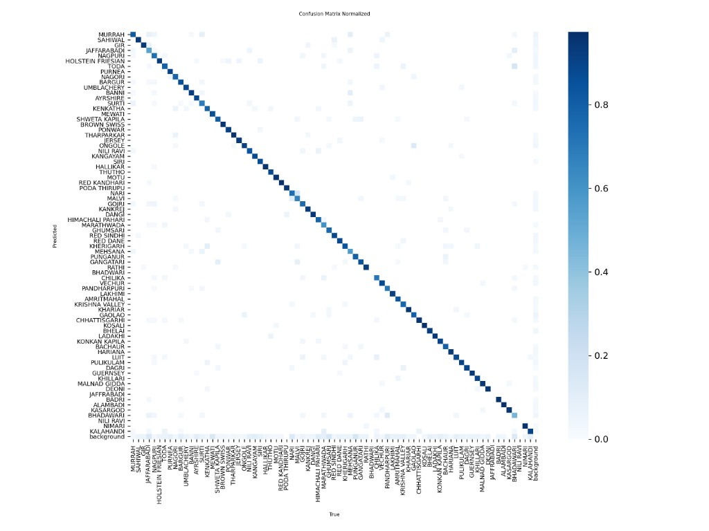 |

| Precision–conf | Recall–conf | F1–conf |
|----------------|-------------|---------|
| 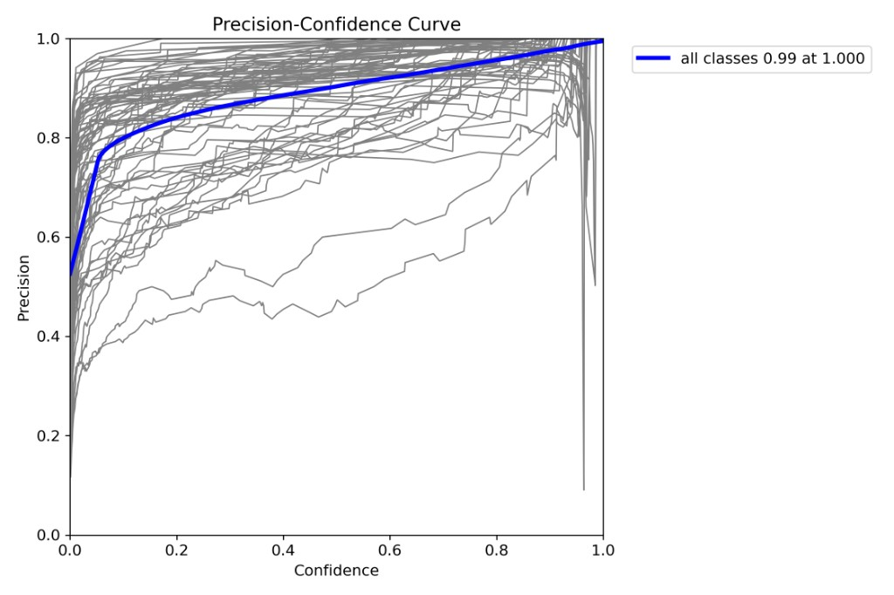 | 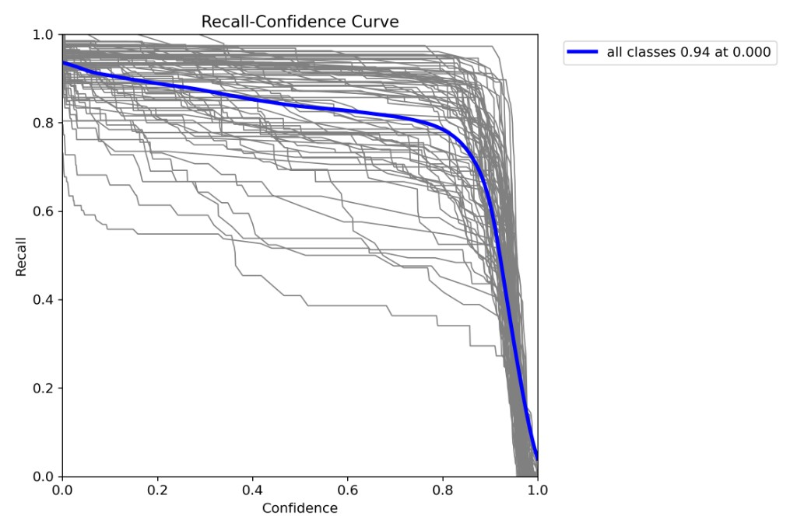 | 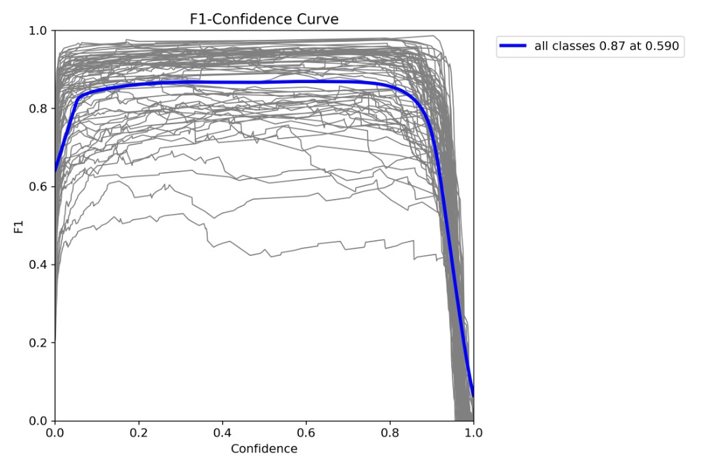 |

| Confusion matrix |
|-------------------|
| 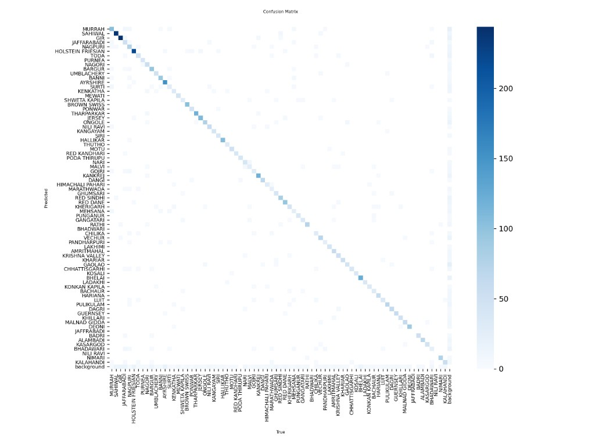 |

See [`public/docs/metrics/README.md`](public/docs/metrics/README.md) for filenames to overwrite.

**UI / demos** (included in this repo):

| YOLO segment demo | Run stats snippet |
|---|---|
| 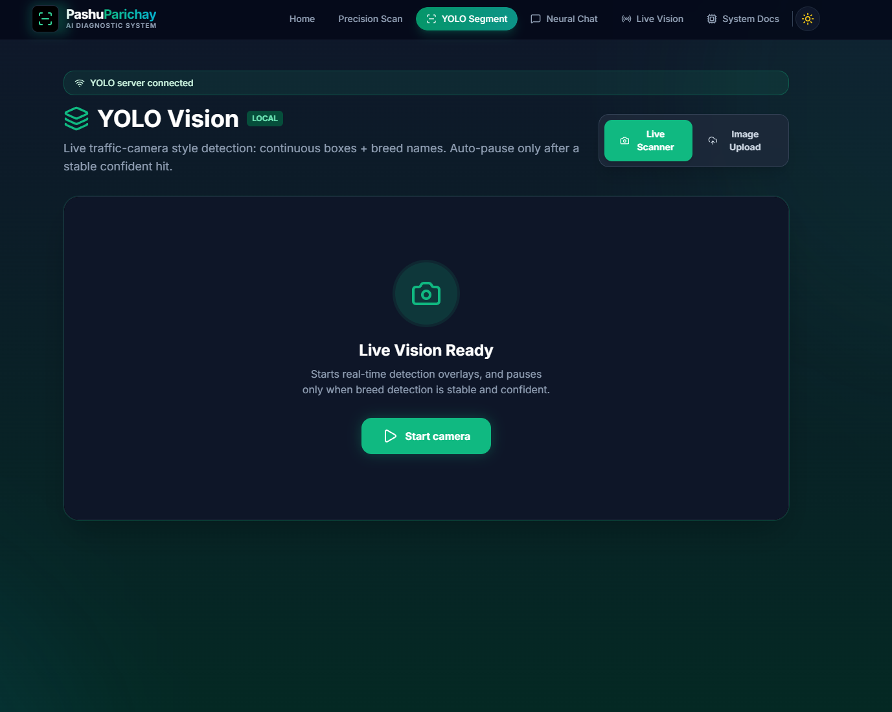 | 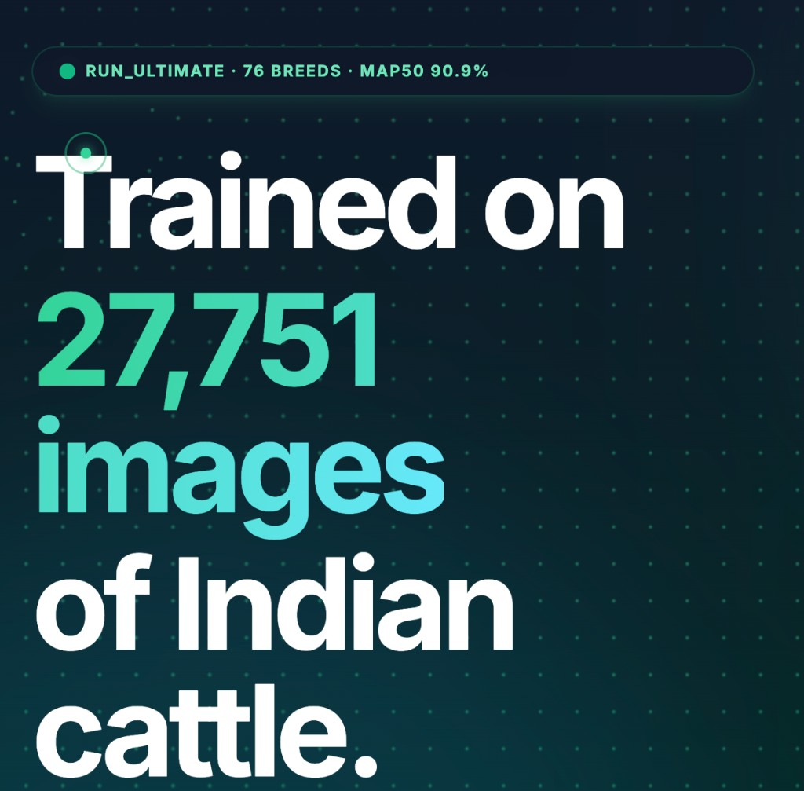 |

| Teachable Machine dashboard |
|---|
| 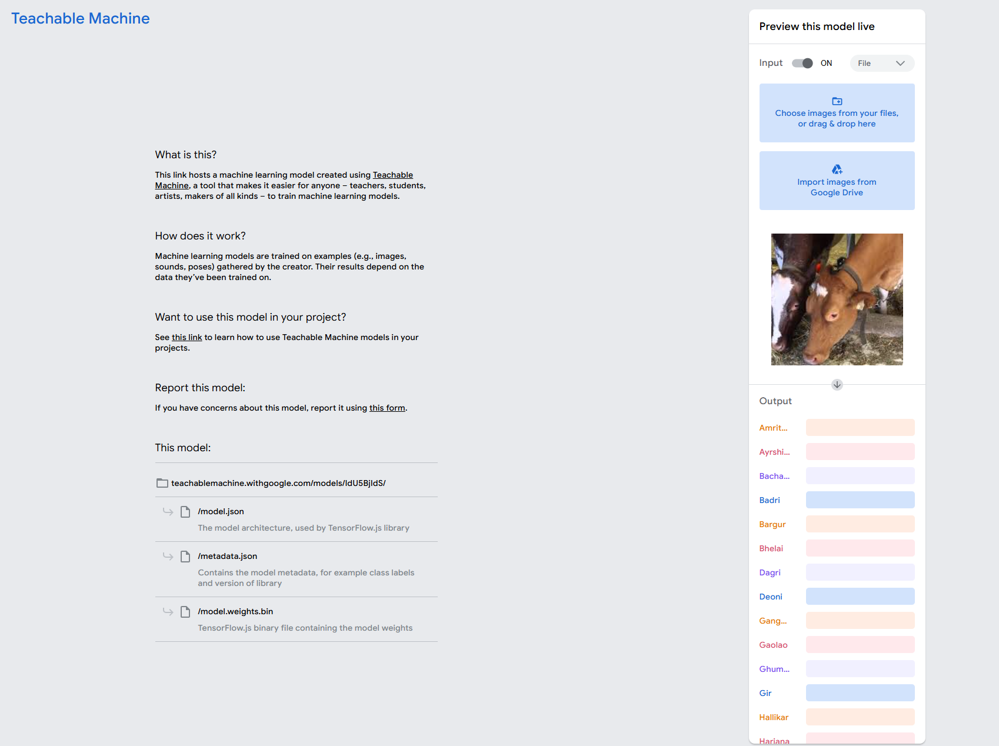 |

Add/replace images under [`public/docs/screenshots/`](public/docs/screenshots/) — see [`public/docs/screenshots/README.md`](public/docs/screenshots/README.md).

---

## Model weights (required for YOLO)

The Python server expects **`model/best.pt`** next to `model/server.py`.

- If `model/best.pt` is already present in your local copy, YOLO is ready.
- If it is missing, copy your trained weight file (e.g. from `run_ultimate`) to **`model/best.pt`**, or set **`YOLO_WEIGHTS`** to an absolute path.

Without weights, `python model/server.py` exits with a clear error.

---

## Prerequisites

- **Node.js** 18+
- **Python** 3.9+ (3.10+ recommended)
- **Gemini API key** — only if you use Precision Scan, chat, breed-detail blurbs, or Live Vision ([Google AI Studio](https://aistudio.google.com/apikey))

---

## Quick start

### One-click run (recommended)

```bash
npm run one-click
```

This does setup + starts both frontend and YOLO server in one command.

On macOS, you can also double-click **`run.command`** from Finder.

### One-time setup

```bash
npm run setup
```

Installs npm dependencies and Python packages from **`model/requirements.txt`** (includes PyTorch — large download).

> Windows note: commands are now shell-agnostic (no `sh`), so `npm run setup` and `npm run dev:stack` work in PowerShell/CMD when `python` is available in `PATH`.

### Environment

```bash
cp .env.example .env.local
# Edit .env.local — set GEMINI_API_KEY for Gemini features
```

### Run frontend + YOLO API together (recommended)

```bash
npm run dev:stack
```

- **Vite** dev server (default **http://localhost:3000**), with **`/api`** proxied to the YOLO server
- **YOLO FastAPI** on **http://127.0.0.1:8000**

### Run services separately

```bash
npm run dev          # frontend only
npm run dev:yolo     # YOLO API
```

### Production build

```bash
npm run build
npm run preview      # still proxy /api to 8000 like dev
```

For deployed static hosting, set **`VITE_YOLO_API_BASE`** to a reachable YOLO server URL (see `.env.example`).

---

## Environment

| Variable | Where | Purpose |
|----------|--------|---------|
| `GEMINI_API_KEY` | `.env.local` | Gemini (scanner, chat, breed details) |
| `VITE_YOLO_API_BASE` | `.env.local` | Override YOLO base URL (default: `/api` in dev) |
| `YOLO_WEIGHTS` | shell env for Python | Path to `best.pt` if not `model/best.pt` |
| `YOLO_MAX_UPLOAD_MB` | shell env for Python | Max upload size for `/segment` (default **8**) |

`vite.config.ts` injects `GEMINI_API_KEY` for the client where needed.

---

## Project layout

```text
├── App.tsx                 # Shell, lazy routes, motion/cursor gating
├── components/             # UI (Scanner, YoloSegment, TechnicalDocs, …)
├── services/               # Gemini, YOLO client, Teachable Machine
├── model/
│   ├── server.py           # FastAPI /health, /segment
│   ├── requirements.txt
│   └── best.pt             # YOU add trained weights here
├── public/docs/metrics/    # Chart PNGs for Technical Docs (+ README)
└── public/docs/screenshots/# Optional README / demo screenshots
```

---

## YOLO training & dataset (summary)

The in-app docs anchor **`#yolo`** covers **`run_ultimate`** hyperparameters and validation numbers. Dataset highlights:

- **Merged sources:** multiple cattle/buffalo datasets combined into one label space.
- **Synthetic & augmented data:** used where needed so breeds meet **minimum count/quality thresholds** before balancing.
- **Balancing:** `balance_dataset.py` targets ~**400 images per breed**; `prepare_data_v2.py` uses a YOLOv8 cropper with low-confidence drops (some classes stay below 400).

**Reported validation (same lineage as docs):** mAP50 ≈ **90.9%**, mAP50–95 ≈ **88.3%**, precision ≈ **91.9%**, recall ≈ **82.9%** — see Technical Docs for curves and tables. (Docs currently describe **73 breeds** in the consolidated label space.)

---

## Architecture (high level)

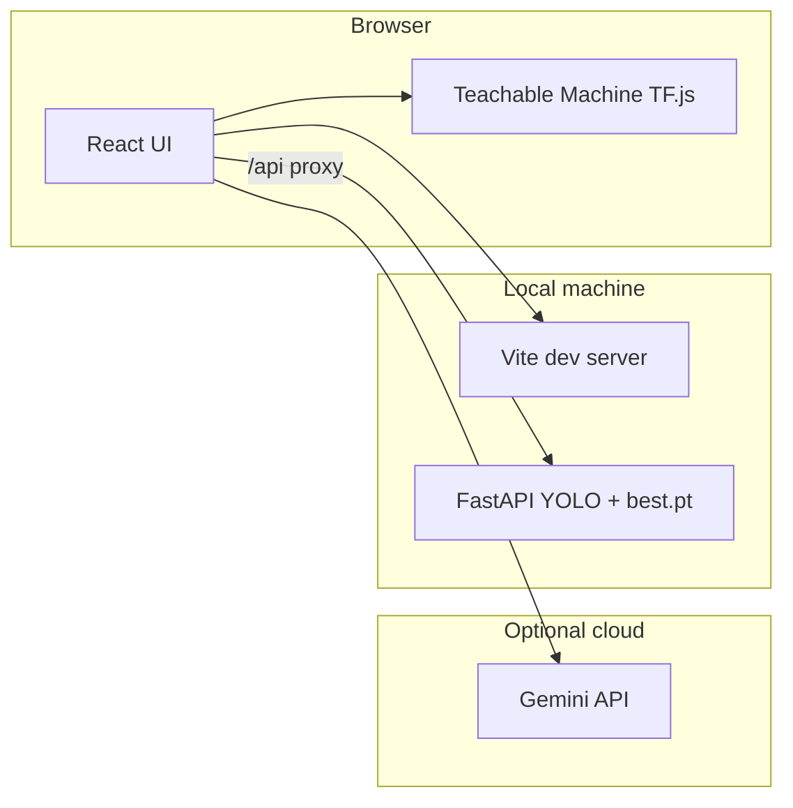

---

## NPM scripts

| Script | Description |
|--------|-------------|
| `npm run setup` | `npm install` + `python -m pip install -r model/requirements.txt` |
| `npm run dev` | Vite only |
| `npm run dev:yolo` | YOLO server only |
| `npm run dev:stack` | Vite + YOLO via `concurrently` |
| `npm run one-click` | Setup + full stack startup in one command |
| `npm run doctor` | TypeScript + production build health check |
| `npm run build` | Production bundle |
| `npm run preview` | Serve `dist/` |
| `npm run lint` | `tsc --noEmit` |

---

## Troubleshooting

- **YOLO Segment “not reachable”** — Start `npm run dev:yolo` or `npm run dev:stack`; confirm **http://127.0.0.1:8000/health** returns JSON.
- **Port 8000 busy** — Stop the other process or change the port in `model/server.py` and align the Vite proxy.
- **`best.pt` not found** — Place weights in `model/best.pt` or set `YOLO_WEIGHTS`.
- **Gemini errors** — Check `GEMINI_API_KEY` in `.env.local` and billing/quotas on AI Studio.
- **PyTorch / NumPy issues** — Install from project **`model/requirements.txt`** (`npm run setup`); it pins NumPy for Torch compatibility.

---

## Recent optimization pass

- Stabilized async UI flows to prevent white-screen route crashes when Gemini is not configured.
- Reduced animation and cursor overhead with adaptive device gating and lower per-frame style churn.
- Improved scanner race-safety so stale async responses cannot overwrite fresh results.
- Enabled custom cursor + interactive dots across all views while keeping reduced-motion and low-power fallbacks.
- Reduced YOLO live-scan memory churn by reusing frame canvases.
- Fixed upload object URL cleanup to avoid browser memory leaks during repeated image scans.
- Made dev startup scripts Windows-friendly by removing shell-specific `sh` commands.
- **Charts look generic** — Replace files in `public/docs/metrics/` with real Ultralytics PNGs (same filenames).

---

## What’s missing / suggested next steps

| Item | Note |
|------|------|
| **`model/best.pt`** | Required for YOLO. If your copy already has it, no action needed. |
| **Real metric PNGs** | Repo has **placeholders**; overwrite with `run_ultimate` exports. |
| **Teachable Machine model URLs** | Confirm `services/tmService.ts` URLs match your hosted TM exports. |
| **Tests / CI** | No automated test suite yet — add Vitest + API smoke tests if you need regression safety. |
| **Docker** | Optional: one `Dockerfile` for YOLO API + `docker-compose` with Vite for demos. |
| **License & third-party data** | If you publish, document dataset licenses for merged + synthetic sources. |

---

## Security

- Never commit **`.env.local`** or live API keys.
- Rotate keys if they were ever shared in chat or screenshots.
- The YOLO `/segment` endpoint accepts image uploads — keep the API **local** or protect it behind auth if exposed.

---

## License

Specify your team’s license here (e.g. MIT, Apache-2.0, or “all rights reserved” for SIH submission).

---

## Credits

- **Ultralytics YOLO** — detection / segmentation
- **Google Gemini** — vision, chat, live assistant
- **TensorFlow.js** — Teachable Machine inference in-browser

Team and roles are listed in the in-app **Technical documentation** → **Project team**.
